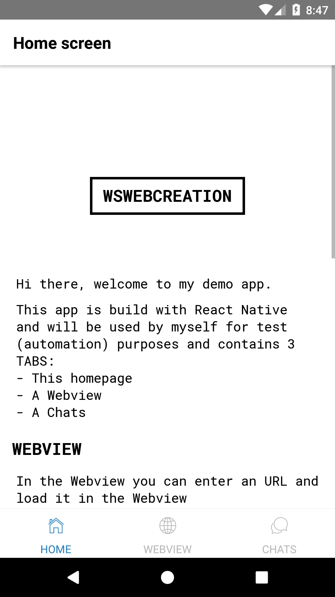
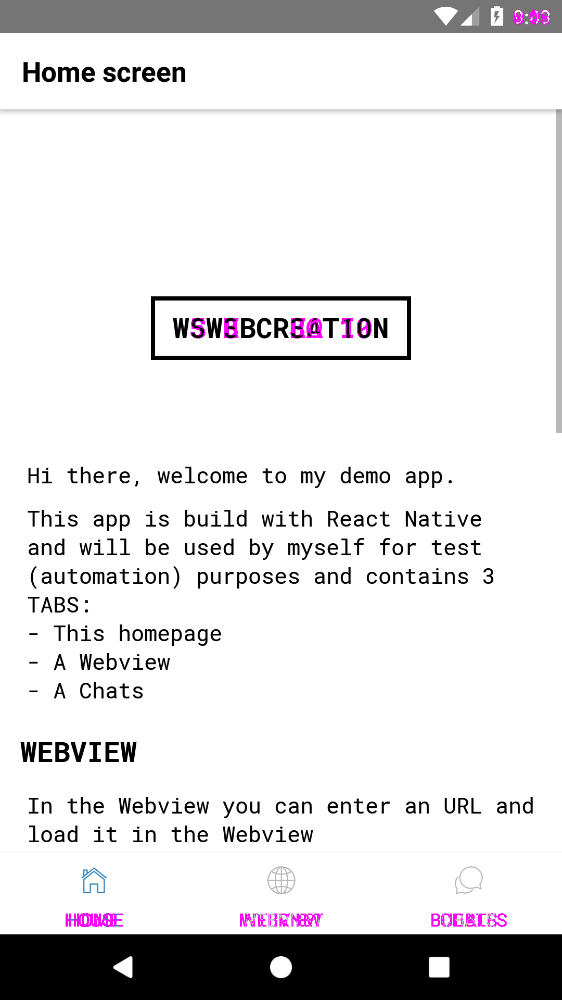
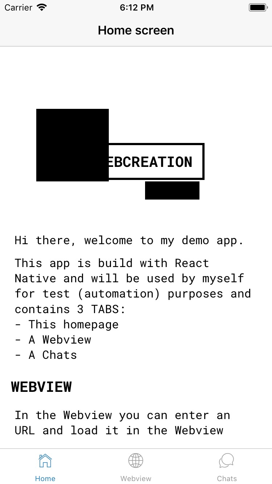
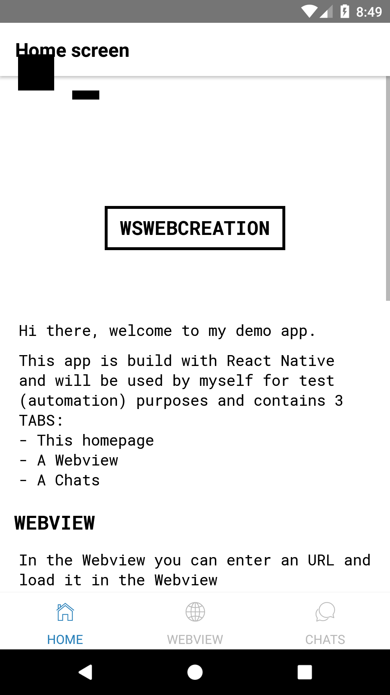
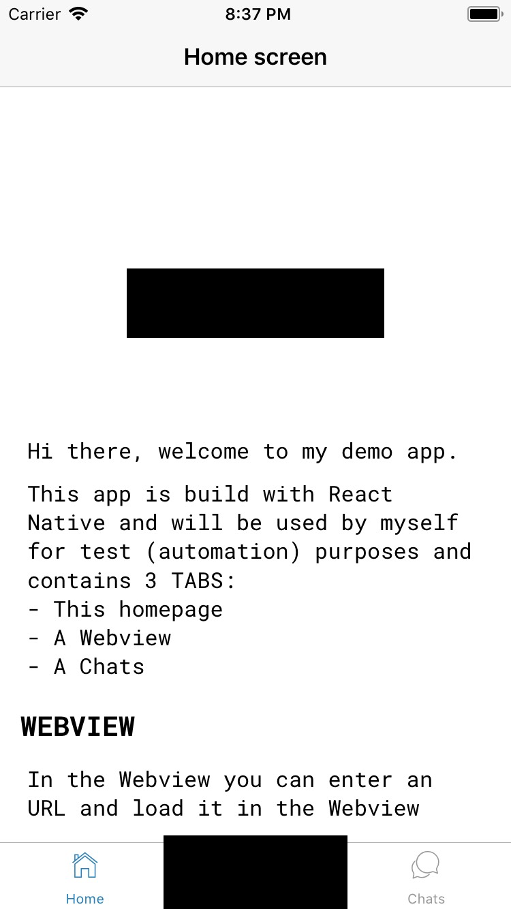
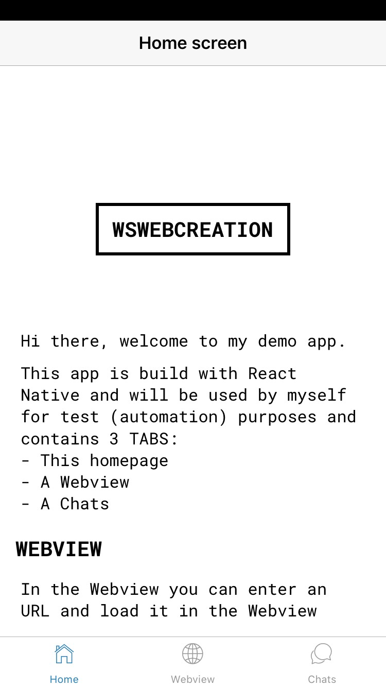
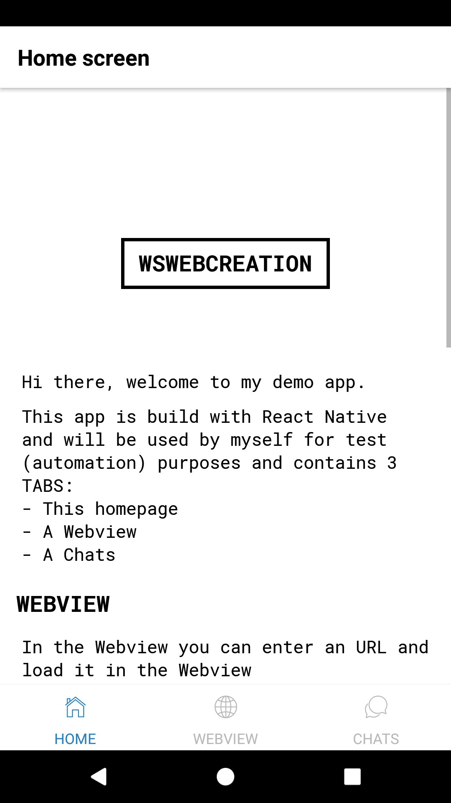
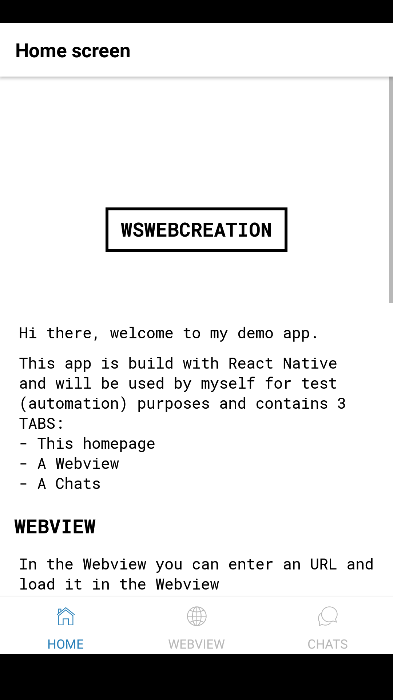

OUTPUT
======
Below the output in real format and sizes

## Save output
### saveElement
#### IOS


---

#### ANDROID


### saveScreen
#### IOS


---

#### ANDROID


## Check output on failure
### checkElement
#### IOS


---

#### ANDROID


### checkScreen
#### IOS


---

#### ANDROID


## Block outs
>**Blockouts are only added on comparison, and are not saved in the actual images.They will be only shown when a difference is there and they can be found in the `diff`-folder**

### blockOuts

```js
browser.compareScreen(
  'compare-home-screen-blockouts',
  {
    blockOuts: [
      // block out area 1
      {
        height: 100,
        width: 100,
        x: 50,
        y: 150,
      },
      // block out area 2
      {
        height: 25,
        width: 75,
        x: 200,
        y: 250,
      },
    ],
  },
);
```

#### IOS


---

#### ANDROID


### elementBlockOuts

```js
device.compareScreen(
  'compare-home-screen-element-blockouts',
  {
    elementBlockOuts: [
      { element: $(logo) },
      {
        element: $(`${TEST_PREFIX}${labels.tabNavigator.webview}`),
        margin: 10,
      },
    ],
  },
);
```

#### IOS


---

#### ANDROID


### blockOutStatusBar

```js
device.compareScreen(
  'compare-home-screen-element-blockouts',
  {
    blockOutStatusBar: true,
  },
);
```

#### IOS


---

#### ANDROID


### blockOutNavigationBar

```js
device.compareScreen(
  'compare-home-screen-element-blockouts',
  {
    blockOutNavigationBar: true,
  },
);
```

#### ANDROID

