OUTPUT
======
Below the output in real format and sizes

## Save output
### saveElement
#### IOS
```js
browser.saveElement($('~selector'), 'saveElement');
```
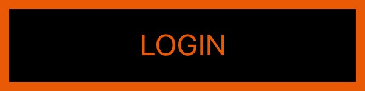

##### With positive resizeDimensions
```js
browser.saveElement(
    $('~selector'),
    'saveElement-positive-resized',
    {
        resizeDimensions: {
          top: 200,
          right: 20,
          bottom: 100,
          left: 40
        }
    }
);
```
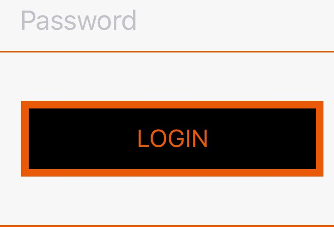

##### With negative resizeDimensions
```js
browser.saveElement(
    $('~selector'),
    'saveElement-negative-resized',
    {
        resizeDimensions: {
          top: -40,
          right: -20,
          bottom: -70,
          left: -250
        }
    }
);
```


---

#### ANDROID
```js
browser.saveElement($('~selector'), 'saveElement');
```


##### With positive resizeDimensions
```js
browser.saveElement(
    $('~selector'),
    'saveElement-positive-resized',
    {
        resizeDimensions: {
          top: 200,
          right: 20,
          bottom: 100,
          left: 40
        }
    }
);
```
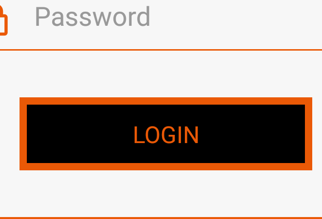

##### With negative resizeDimensions
```js
browser.saveElement(
    $('~selector'),
    'saveElement-negative-resized',
    {
        resizeDimensions: {
          top: -40,
          right: -20,
          bottom: -70,
          left: -250
        }
    }
);
```


### saveScreen
```js
driver.saveScreen('saveScreen');
```
#### IOS
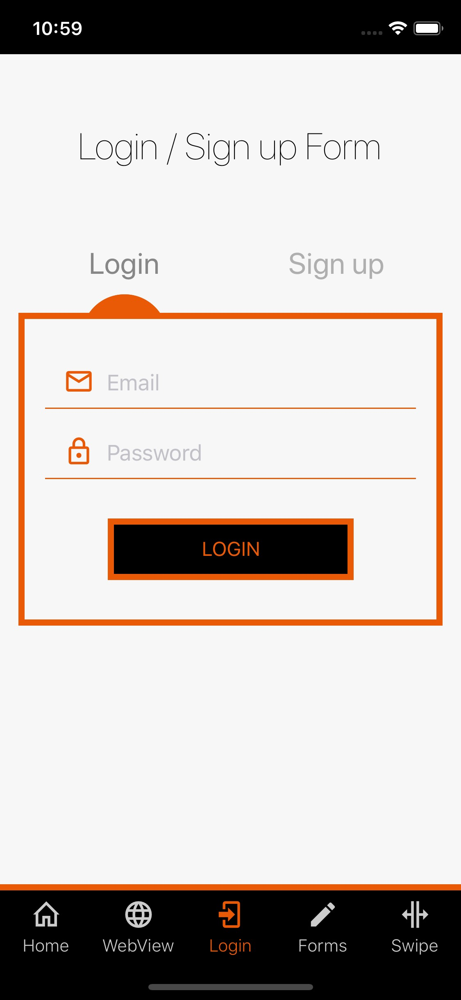

---

#### ANDROID
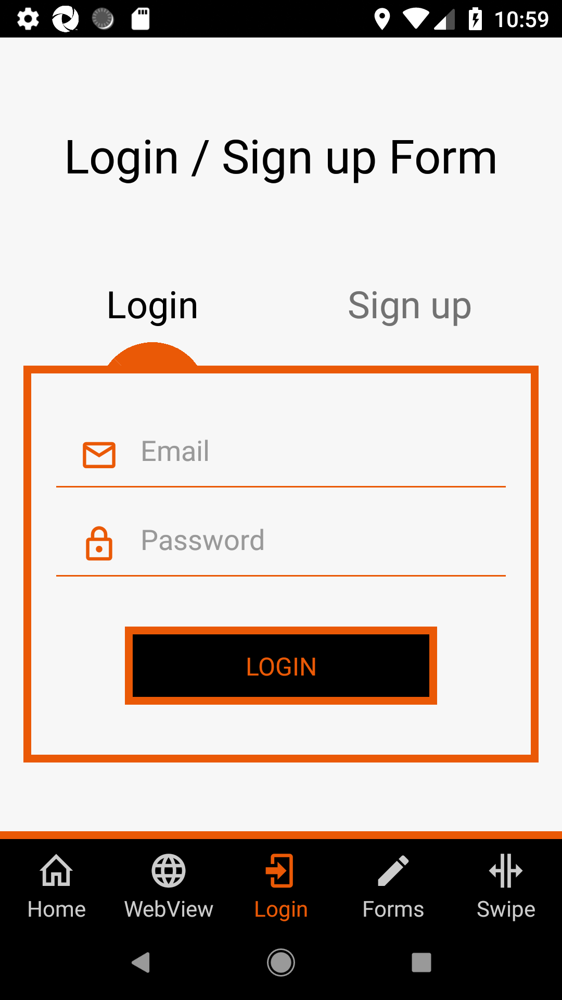

## Check output on failure
### compareElement
#### IOS
```js
driver.compareElement($('~selector'), 'compareElement');
```
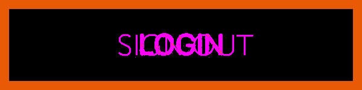

---

#### ANDROID
```js
driver.compareElement($('~selector'), 'compareElement');
```


### compareScreen
#### IOS
```js
driver.compareScreen('compareScreen');
```
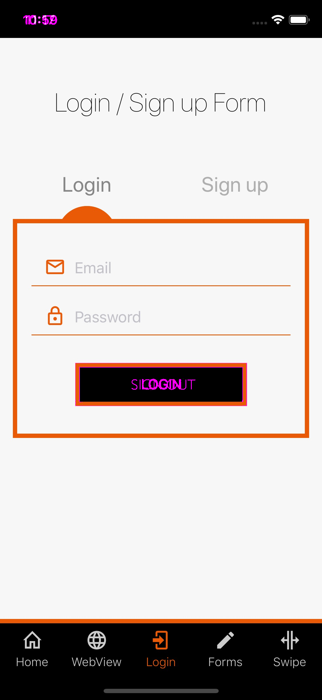

---

#### ANDROID
```js
driver.compareScreen('compareScreen');
```
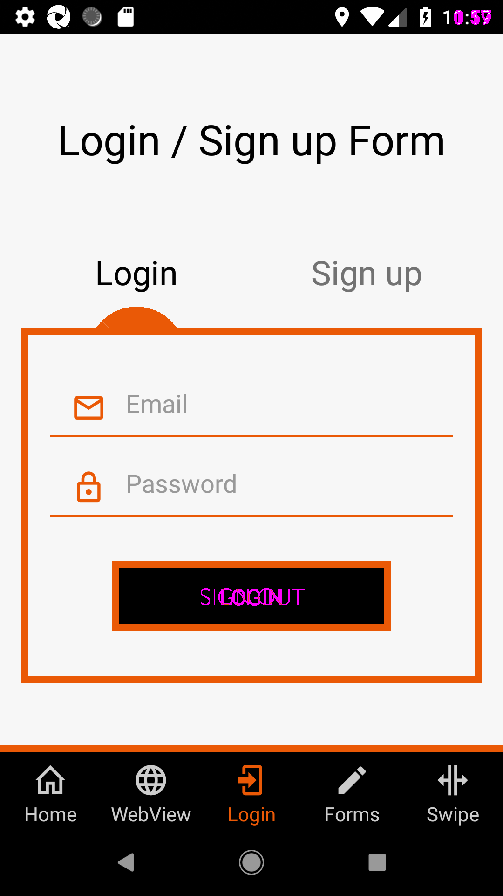

## Block outs
>**Blockouts are only added on comparison, and are not saved in the actual images.They will be only shown when a difference is there and they can be found in the `diff`-folder**

### blockOuts
```js
driver.compareScreen(
  'compareScreen-blockOuts',
  {
    blockOuts: [
      // block out area 1
      {
        height: 100,
        width: 100,
        x: 250,
        y: 900,
      },
      // block out area 2
      {
        height: 25,
        width: 75,
        x: 50,
        y: 400,
      },
    ],
  },
);
```

#### IOS
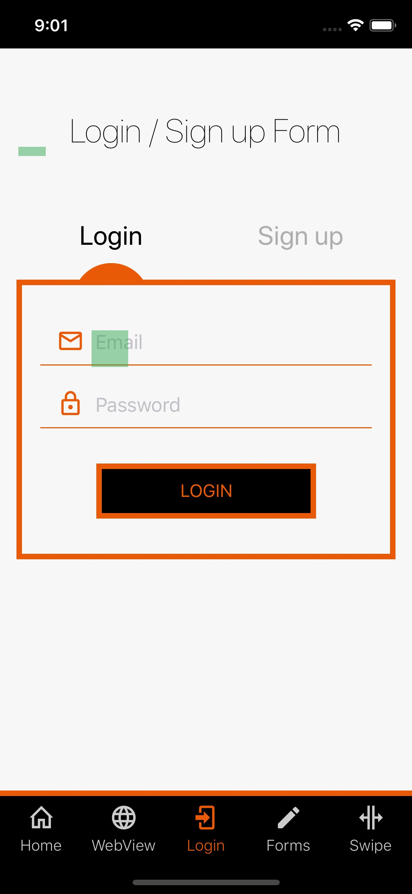

---

#### ANDROID
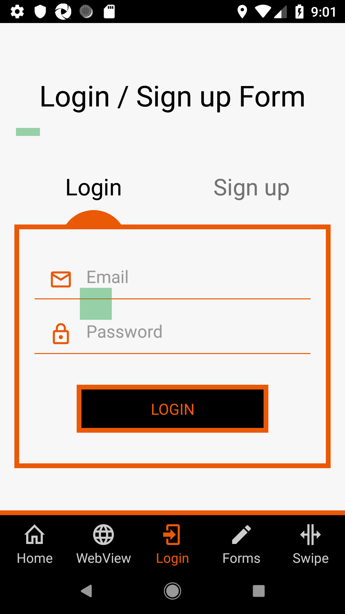

### elementBlockOuts
```js
driver.compareScreen(
  'compareScreen-elementBlockOuts',
  {
    elementBlockOuts: [
      // block out element 1
      { element: $('~selector') },
      // block out element 2 (shorthand) with margin
      {
        element: $('~selector-2'),
        margin: 50,
      },
    ],
  },
);
```

#### IOS
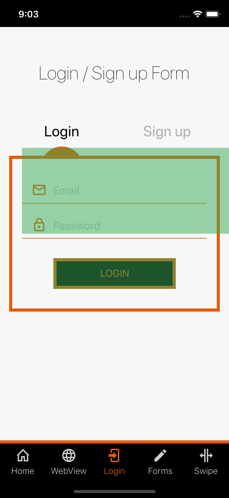

---

#### ANDROID
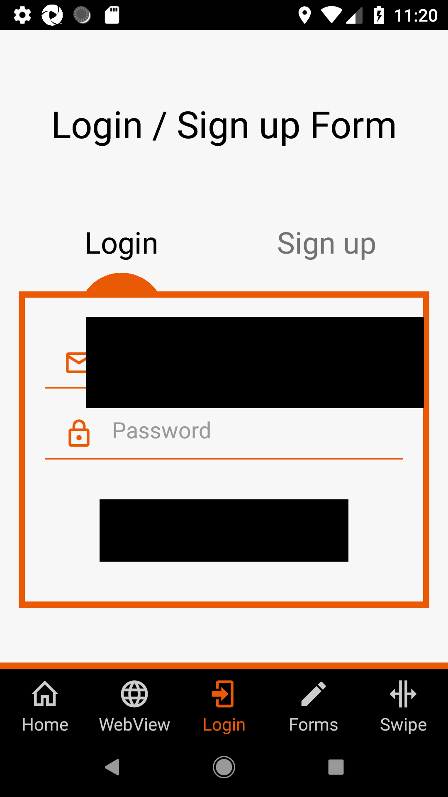

### blockOutStatusBar || blockOutNavigationBar || blockOutIphoneHomeBar
```js
driver.compareScreen(
  'compare-home-screen-element-blockouts',
  {
    blockOutStatusBar: true,
    blockOutNavigationBar: true,
    blockOutIphoneHomeBar: true,
  },
);
```

#### IOS
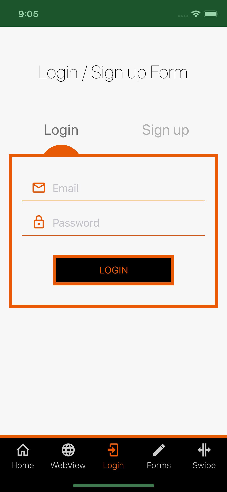

---

#### ANDROID
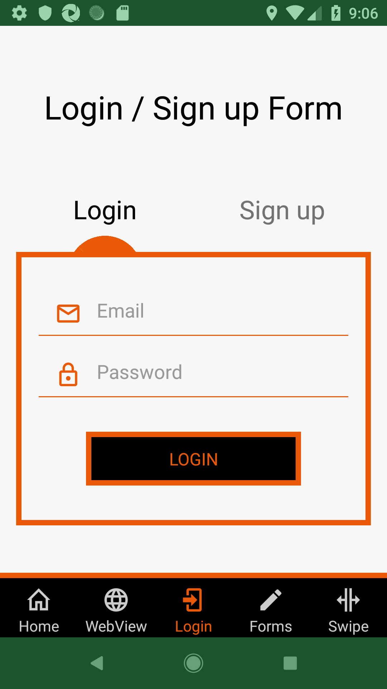
